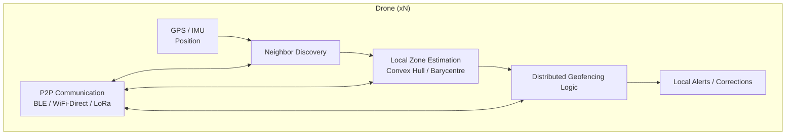
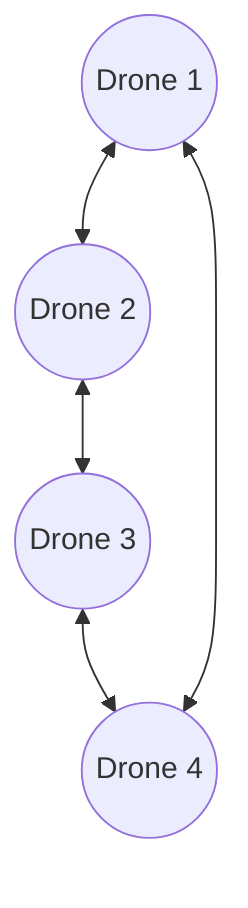

# **DroneGeoTracking**

## **Contexte du projet**

DroneGeoTracking s’inscrit dans le cadre d’un projet de systèmes distribués visant à analyser et implémenter une solution à un problème concret de coordination et de suivi en environnement décentralisé.
Le cas étudié est celui d’une flotte de drones devant surveiller une **zone mouvante**, sans serveur central ni drone leader, dans un contexte où les positions changent en permanence et où la communication est intermittente et locale.

L’objectif général est d’explorer les mécanismes nécessaires pour maintenir la cohésion d’un groupe d’entités mobiles autonomes grâce à une approche distribuée.

---

## **Objectifs du travail**

* Définir une **problématique claire** liée aux systèmes répartis : *comment réaliser du géofencing dynamique dans un environnement entièrement décentralisé ?*
* Proposer une **méthode de résolution** cohérente avec les contraintes d’un réseau P2P opportuniste.
* Implémenter une **preuve de concept** permettant à chaque drone de :

  * détecter ses voisins,
  * estimer localement la zone du groupe,
  * déterminer s’il est en bordure ou en sortie de zone,
  * générer ou relayer des alertes distribué­es.

---

## **Méthodologie**

La solution adoptée repose sur trois principes fondamentaux :

### **1. Communication locale et opportuniste**

Chaque drone communique uniquement avec les drones à portée via BLE, WiFi-Direct ou LoRa.
Cette approche permet un maillage dynamique, sans infrastructure et naturellement résilient.

### **2. Estimation locale de la zone**

La zone n’existe pas en tant qu’objet global.
Elle est déduite de manière indépendante par chaque drone à partir de :

* sa position,
* la liste de ses voisins,
* la frontière locale estimée (enveloppe convexe, densité, barycentre local).

Cette démarche rend la zone **émergente**, flexible et adaptée à un environnement mouvant.

### **3. Géofencing décentralisé**

Chaque drone exécute une logique embarquée lui permettant de :

* détecter s’il est en bordure du groupe,
* détecter la sortie d’un voisin,
* ajuster sa trajectoire ou relayer une alerte,
* contribuer à la cohésion globale sans coordination centrale.

---

## **Fonctions du produit**

* Scan et découverte de drones voisins
* Échange P2P des positions
* Estimation locale de la zone (géométrie simplifiée)
* Détection de sortie de zone
* Système d’alertes distribuées
* Visualisation ou logs de l’état local du drone

---

## **Technologies**

Le projet s’appuie sur :

* Protocoles de communication : **BLE**, **WiFi-Direct**, ou **LoRa** (selon plateforme)
* Langage et runtime : **Python**
* Algorithmes distribués :

  * découverte de voisins
  * enveloppe convexe approximée
  * centre de masse local
  * géofencing distribué

---

## **Architecture**

### **Vue logique du fonctionnement d’un drone**

### **Maillage distribué entre drones**

